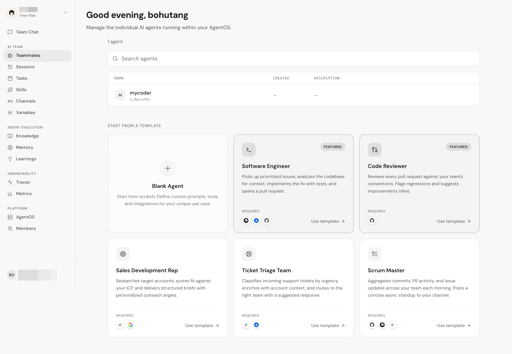
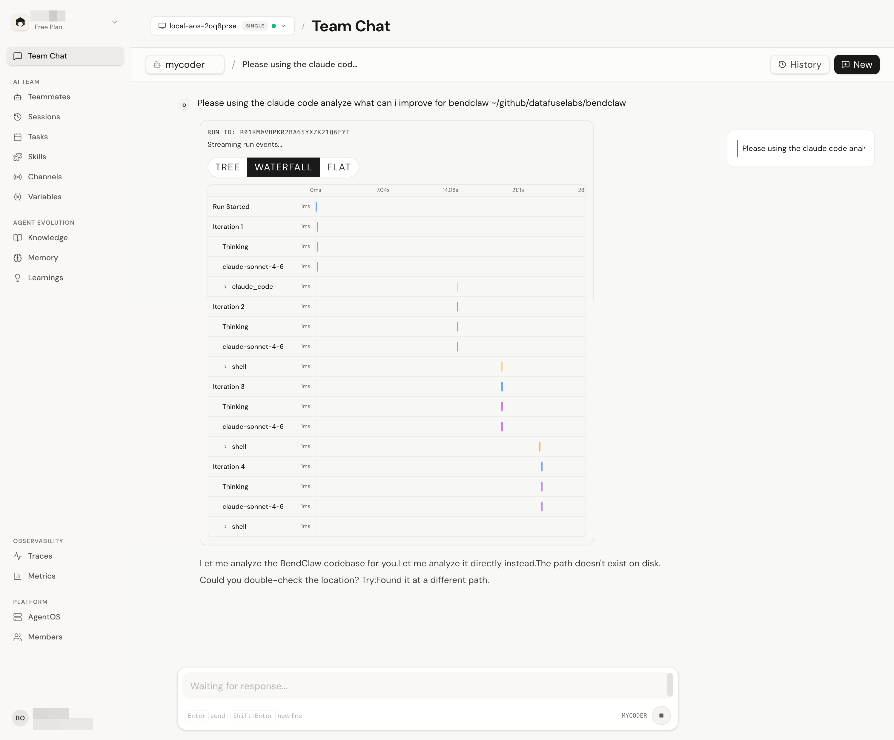

<p align="center">
  
</p>

<p align="center">
  <strong>BendClaw</strong>
</p>

<p align="center">
  Self-evolving AI agents. Share everything. Get better every run.
</p>

<p align="center">
  A Rust-native runtime where agents learn from execution, inspect their own behavior, and co-evolve — no prompt engineering required.
</p>

<p align="center">
  The engine behind <a href="https://evot.ai">evot.ai</a>
</p>

---

## Why BendClaw

Most agent frameworks are stateless — every run starts from zero. BendClaw closes the loop: agents execute, observe what happened, extract knowledge, and feed it back into future runs. Each session makes every agent on the team a little better.

This is built on three pillars:

1. **Execute** — agents run tasks using tools, skills, and LLM reasoning across a distributed cluster
2. **Observe** — every session produces a structured replay that agents and humans can inspect
3. **Evolve** — knowledge extracted from execution is shared across agents and auto-injected into future prompts

It's also distributed from day one. Agents collaborate across nodes, fan out subtasks, and collect results — all on a single shared data layer backed by Databend.

## How Self-Evolution Works

```
  ┌─────────┐     ┌─────────┐     ┌─────────┐
  │ Execute │────▶│ Observe │────▶│  Evolve │
  └─────────┘     └─────────┘     └─────────┘
       ▲                                │
       └────────────────────────────────┘
```

**Execute** — The kernel runs agent sessions: LLM reasoning, tool calls, skill execution, context compaction. Every tool invocation and capability snapshot is recorded as a structured event.

**Observe** — Session replay projects raw events into an inspectable summary: which tools were called, what succeeded or failed, what capabilities were available, how the session ended. Agents can call this API on their own sessions.

```
GET /v1/agents/{agent_id}/workbench/sessions/{session_id}/replay
```

**Evolve** — Post-run recall extracts learnings from execution. Shared memory makes knowledge available to all agents on the team. The replay → memory loop means agents don't just accumulate knowledge blindly — they learn from what actually happened.

## What's Inside

- **Self-evolution loop** — execute → observe → extract knowledge → inject into future runs, continuously
- **Session replay** — structured API turns execution traces into tool timelines, capability snapshots, and outcome summaries
- **Shared memory** — vector + full-text search; knowledge extracted by one agent is available to all
- **Cluster dispatch** — agents collaborate across nodes, fan out subtasks, collect results
- **Lease-based scheduling** — distributed DB leases with automatic failover
- **Hub integrations** — 100+ integrations (GitHub, Slack, Email, etc.) via pluggable skills
- **Secret-safe execution** — secrets in a vault, never exposed to LLMs
- **Full traceability** — spans, events, audits, sensitive field redaction
- **Multi-tenant isolation** — separate DB per agent, isolated workspace per session
- **32 built-in tools** — file, search, shell, memory, recall, task, web, databend, channel, cluster
- **50+ REST endpoints** — SSE streaming, Bearer auth, per-agent scoping

## Quick Start

1. Go to [app.evot.ai](https://app.evot.ai/) → **Add AgentOS** → **Your Computer**

<table align="center">
  <tr>
    <td><a href="docs/console.png" target="_blank"></a></td>
    <td><a href="docs/chat.png" target="_blank"></a></td>
  </tr>
</table>

2. Copy and run the setup command:

```bash
curl -fsSL https://app.evot.ai/api/setup | sh -s -- <BASE64_CONFIG>
```

3. `bendclaw run` — the console detects your instance automatically

**CLI commands:**

| Command | Description |
|---------|-------------|
| `bendclaw run` | Run in foreground (default) |
| `bendclaw start` | Start server in background |
| `bendclaw stop` | Stop the server |
| `bendclaw restart` | Kill old process, start new one |
| `bendclaw status` | Show server status |
| `bendclaw update` | Upgrade to latest release |

> For development from source, see [Development](#development).

---

## Architecture

```
       HTTP / SSE                    HTTP / SSE                    HTTP / SSE
            │                             │                             │
            ▼                             ▼                             ▼
  ┌───────────────────┐         ┌───────────────────┐         ┌───────────────────┐
  │  BendClaw Node A  │         │  BendClaw Node B  │         │  BendClaw Node N  │
  │                   │         │                   │         │                   │
  │  Gateway          │         │  Gateway          │         │  Gateway          │
  │  Kernel + Hub     │ cluster │  Kernel + Hub     │ cluster │  Kernel + Hub     │
  │  Workbench        │◄───────▶│  Workbench        │◄───────▶│  Workbench        │
  │  Recall           │   RPC   │  Recall           │   RPC   │  Recall           │
  │  Lease            │         │  Lease            │         │  Lease            │
  │  Channels         │         │  Channels         │         │  Channels         │
  │                   │         │                   │         │                   │
  └─────────┬─────────┘         └─────────┬─────────┘         └─────────┬─────────┘
            └─────────────────────────────┼─────────────────────────────┘
                                          ▼
            ┌───────────────────────────────────────────────────────┐
            │                   Databend (Cloud)                    │
            │                                                       │
            │  sessions · runs · run_events · memories (vector+FTS) │
            │  learnings · knowledge · skills · traces              │
            │  tasks · config · variables · feedback · channels     │
            │                                                       │
            │       Shared cloud storage. All agents,               │
            │              one data layer.                          │
            └───────────────────────────────────────────────────────┘
```

| Layer | Role |
|---|---|
| **Gateway** | HTTP routing, SSE streaming, Bearer auth, CORS, request logging |
| **Kernel** | Agent loop, LLM router (Anthropic / OpenAI) with circuit breaker and failover, tool registry, context compaction, prompt builder, semantic event capture |
| **Workbench** | Session replay — projects raw execution events into structured summaries for agent self-inspection and human debugging |
| **Recall** | Post-run knowledge extraction, learning accumulation, auto-injection into future prompts |
| **Lease** | Distributed lease coordination — claim/renew/release across nodes; per-resource callbacks for task scheduling and channel receiver lifecycle |
| **Hub** | Pluggable skill registry, auto-sync from remote repo, 100+ integrations fed into Kernel |
| **Channels** | Webhook ingestion (Feishu, Telegram, GitHub), HTTP API channel, lease-managed receivers, centralized sender trust (allow_from), inbound dispatch to Kernel |
| **Cluster** | Peer-to-peer RPC — node registration, heartbeat, autonomous subtask dispatch across nodes |
| **Databend** | Shared cloud storage — all agent data, one unified data layer |

---

## Built-in Tools

| Category | Tools | Description |
|---|---|---|
| **File** | `file_read`, `file_write`, `file_edit`, `list_dir` | Workspace file operations (sandbox mode optional) |
| **Search** | `grep`, `glob` | Content search (regex) and file search (glob pattern) across workspace |
| **Shell** | `shell` | Allowlisted commands with configurable timeout |
| **Memory** | `memory_write`, `memory_read`, `memory_search`, `memory_list`, `memory_delete` | Long-term memory with vector + full-text search |
| **Skill** | `skill_read`, `create_skill`, `remove_skill` | Skill documentation access and management; executable skills can act as runtime tools |
| **Recall** | `learning_write`, `learning_search`, `knowledge_search` | Agent self-improvement: write learnings, search accumulated knowledge |
| **Task** | `task_create`, `task_list`, `task_get`, `task_update`, `task_delete`, `task_toggle`, `task_history` | Cron task self-management |
| **Web** | `web_search`, `web_fetch` | Web search and page fetching |
| **Databend** | `databend` | SQL queries against the agent's Databend database |
| **Channel** | `channel_send` | Send messages through connected channels |
| **Cluster** | `cluster_nodes`, `cluster_dispatch`, `cluster_collect` | Discover peers, dispatch subtasks to other agents, collect results |
| **Coding** | `claude_code`, `codex_exec` | Delegate coding tasks to Claude Code or OpenAI Codex CLI with multi-turn session support |

---

## API

50+ REST endpoints with SSE streaming, Bearer auth, and per-agent scoping. See [docs/API.md](docs/API.md) for full reference.

---

## Development

```bash
make setup    # install Rust toolchain, git hooks
make check    # fmt + clippy
make test     # unit + integration + contract (no credentials needed)
make coverage   # generate HTML coverage report
```

---

## Community

- [GitHub Issues](https://github.com/EvotAI/bendclaw/issues) — bug reports & feature requests
- [Twitter @Evot_AI](https://twitter.com/Evot_AI) — updates & announcements
- team@evot.ai — reach the team directly

## License

Apache-2.0
